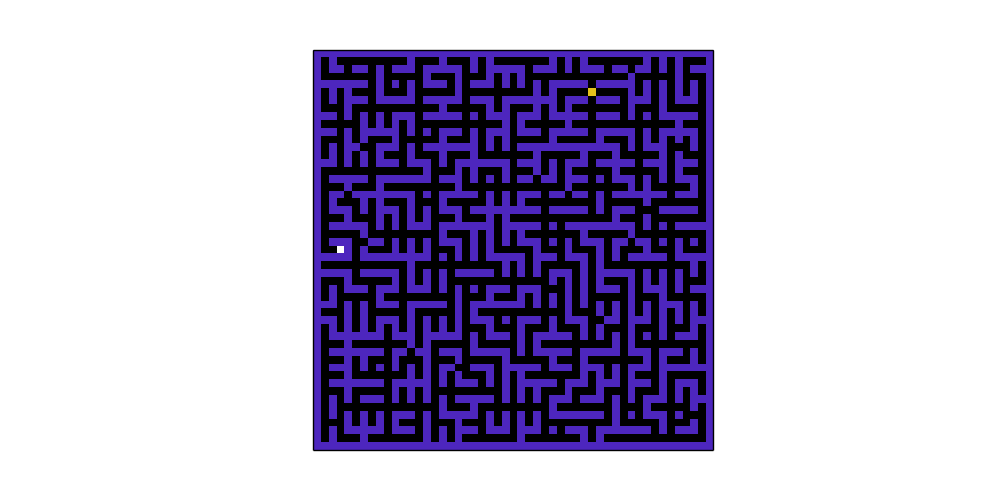
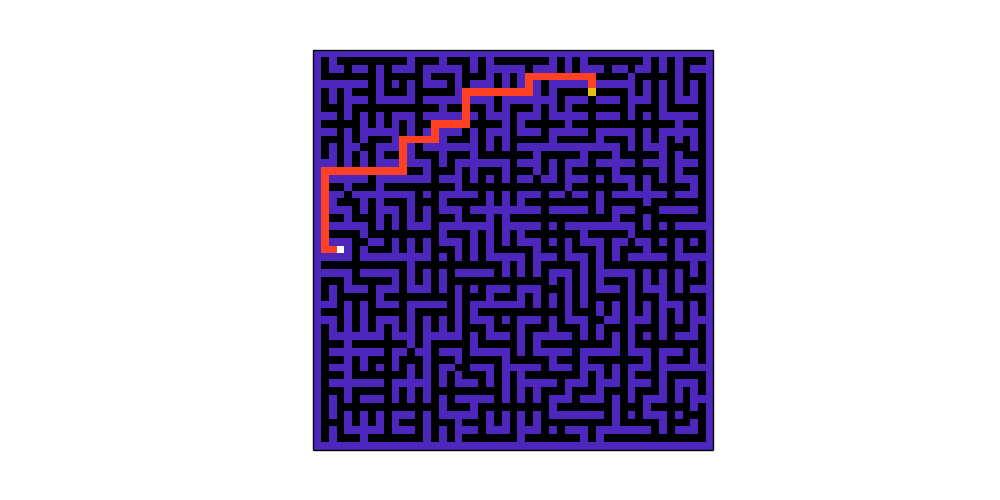

# Maze Solver

This program solves a $$n\times n$$ maze with a starting cell and which can have multiple end cells. This program aims to find the shortest path from start cell to end cell.

- The maze is assumed to consist of \(n_T\) cells in total, out of which \(n_1\) cells have value 1 (wall tiles) and others have value either \(0,\,2,\text{ or }3\). 

- Each non-wall tile is considered as a separate state of MDP. \(\implies \text{ Total }n_T - n_1\) states.

- A transition in the MDP is representated as \([s_t, ac, s_{t+1}, r, 1]\). Here \(s_t\:\&\:s_{t+1}\) are the states at time step <i>t</i> and <i>t+1</i> respectively i.e. before and after taking the action <i>ac</i> from \(s_t\). <i>r</i> represents the reward. The probability of reaching \(s_{t+1}\) from \(s_t\) on taking an action <i>ac</i> is 1 as all the state transitions are deterministic.

- Action from a state can be from \(\{0, 1, 2, 3\}\) which correspond to \(\{N,\,E,\,S,\,W\}\) respectively.

- All the MDPs are episodic tasks and the terminal states are the end states of the maze from where no further transitions can be made.

- If a wall is encountered on taking an action, the MDP returns to its original state thus forming a self loop and receives a penalty for this.

- The rewards for a transition is \(R(s, a, s') = \begin{cases}100(n_T - n_1) & s' \in end\_states \\ -0.5 & otherwise \end{cases}\).

- \(\gamma = 0.99\) for all the MDPs. This will be crucial for solving the MDPs where the shortest path is comparatively long and MDP requires to take into account many states.

- The solution obtained can then be visualized on the maze.

