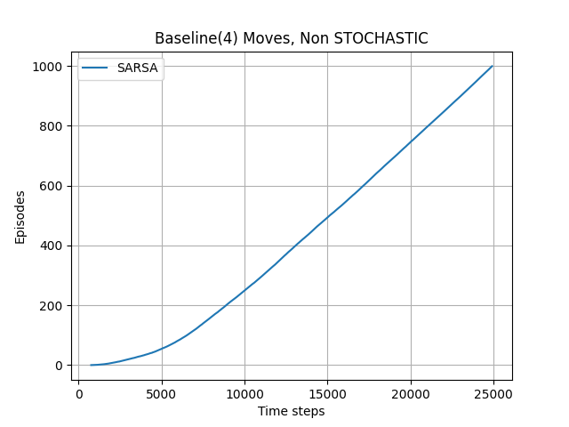
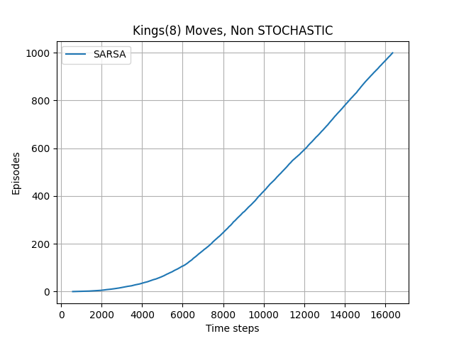
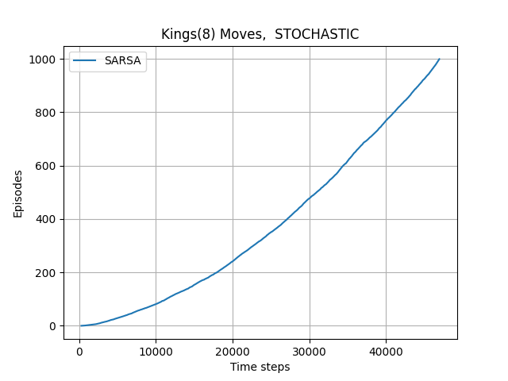
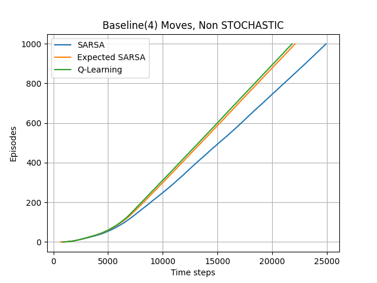

# Windy Gridworld

This program solves the famous windy gridworld problem where the goal is to reach the end cell from a starting cell but there is a wind flowing in a direction for certian cells and hence transitions are stochastic.

There can be either 4 or 8 (King's case) moves allowed from a cell. 

This problem can be solved using SARSA, Expected-SARSA or Q-Learning. The problem can be approached in the following manner.

- The origin is assumed to be on the top left of the grid. X-axis is horizontally right and y-axis is vertically downwards.

- States are numbered in column major order, total states = $$n\_rows \times n\_cols$$.

- Actions are $$[0,\;1,\;2,\;3]$$ for $$[N,\;E,\;S,\;W]$$ in baseline case and $$[0,\;1,\;2,\;3,\;4,\;5,\;6,\;7]$$ for $$[N,\;NE,\;E,\;SE,\;S,\;SW,\;W,\;NW]$$ for King's moves. Reward for every transition is -1.

- If a perimeter wall is encountered, the agent moves to the adjacent cell of the wall.

- We get the following results with our approach.

